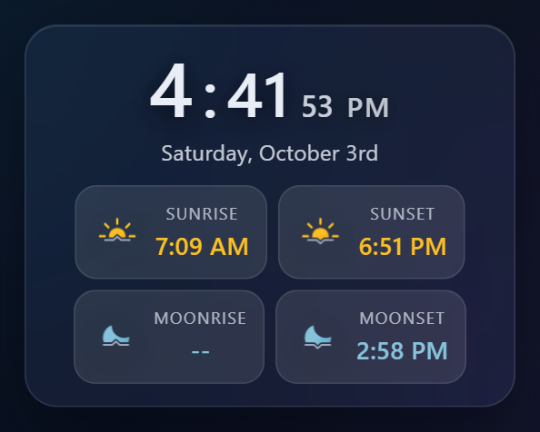

# MMM-GlassClock

Liquid-glass clock module that matches the aesthetic of MMM-AmbientWeather, MMM-MyAgenda, MMM-GlassCalendar, and MMM-GlassDailyCalendar. Shows time/date plus optional sun/moon rise/set chips with bundled Lottie animations.

## Screenshot



*12-hour time with seconds, the date, and sunrise/sunset and moonrise/moonset chips (night theme). Moonrise shows "--" on days the moon does not rise.*

## Features

- Glass card styling with shimmer, glow shadows behind the digits, and the shared glass palette.
- Sun/moon chips with Lottie animations (`sunrise`, `sunset`, `moonrise`, `moonset`); sunrise/sunset text in `#fbbf24`, moonrise/moonset text in `#7dd3fc`.
- Day-only re-rendering: the DOM rebuilds when the day changes; time/seconds update in place for smoothness.
- Timezone-aware via `moment-timezone`, 12/24h support, configurable AM/PM casing, optional seconds.

## Installation

```bash
cd ~/MagicMirror/modules
git clone https://github.com/hearter20176/MMM-GlassClock.git
cd MMM-GlassClock
npm install
```

## Configuration

Add the module to your `config.js`:

```js
{
  module: "MMM-GlassClock",
  position: "bottom_bar",
  config: {
    timeformat: 12,           // 12 or 24
    timezone: "America/New_York",
    displaySeconds: true,
    showPeriod: true,
    showPeriodUpper: true,
    showTime: true,
    showDate: true,
    showSunTimes: true,
    showMoonTimes: true,
    latitude: 40.7128,        // required for sun/moon times
    longitude: -74.0060,
    dateFormat: "dddd, MMMM Do",
    performanceProfile: "auto", // "auto" | "pi" | "full"
    reduceMotion: false,        // true forces iconAnimation "static" (seconds unaffected)
    iconAnimation: "auto"       // "auto" | "loop" | "once" | "static"
  }
}
```

### Options

- `timeformat`: `12` or `24` hour clock. Default follows MagicMirror `config.timeFormat`.
- `timezone`: IANA timezone string (uses `moment-timezone`). `null` = system time.
- `displaySeconds`: Show seconds beside the minutes. Default `true`. Independent of performance settings.
- `showPeriod`: Show AM/PM when using 12-hour time. Default `true`.
- `showPeriodUpper`: Uppercase AM/PM. Default `false`.
- `showTime`: Toggle the time row. Default `true`.
- `showDate`: Toggle the date row. Default `true`.
- `showSunTimes`: Show sunrise/sunset chips (Lottie + `#fbbf24` text). Requires `latitude` and `longitude`. Default `false`.
- `showMoonTimes`: Show moonrise/moonset chips (Lottie + `#7dd3fc` text). Requires coordinates. Default `false`.
- `latitude` / `longitude`: Decimal degrees for solar/lunar times. Falls back to `lat`/`lon` keys if present.
- `dateFormat`: Moment.js format string for the date. Default `dddd, MMMM Do`.
- `animationSpeed`: Milliseconds for DOM update animation. Default `300`.
- `performanceProfile`: `"auto"` detects Pi/ARM (resolves to `"pi"`), `"pi"` or `"full"` forces a profile. The profile only chooses the default `iconAnimation`; it never affects the clock digits or seconds.
- `iconAnimation`: How the sun/moon chip icons animate. `"loop"` plays forever, `"once"` plays one pass on each render then holds the last frame (no ongoing per-frame work), `"static"` draws a single frame and never plays. `"auto"` (default) picks `"once"` on the `pi` profile and `"loop"` on `full`.
- `reduceMotion`: Forces `iconAnimation` to `"static"` (also when the system `prefers-reduced-motion` is set). It does not hide the seconds.
- `themeClass`: When `true` (default), marks `<body>` with `mm-day` / `mm-night` based on sunrise/sunset so `css/custom.css` (and any module that listens for it) can switch light/dark palettes. Sun times are computed for the current calendar date anchored at local noon, so the theme keeps updating correctly across midnight without needing a restart.
- `themeOverride`: `"day"` or `"night"` to force the page theme regardless of sun times; `null` (default) uses the computed day/night state.

Seconds are controlled only by `displaySeconds` (and `showTime`), independent of `performanceProfile`, `reduceMotion`, and `iconAnimation`. Icon players are bound to the exact containers of the rendered tree and destroyed once that tree is swapped out (day rollover re-render), so they never leak or run off-screen. They are paused in `suspend()` and resumed in `resume()` if the module is ever hidden.

## Page theme notification

When `themeClass` is enabled, this module owns the page-wide day/night theme. It marks `<body>` with `mm-day` / `mm-night` and, on every actual day/night transition, broadcasts:

```js
this.sendNotification("PAGE_THEME_CHANGED", { mode: "day" | "night" });
```

At true module startup this notification reaches nobody: MagicMirror only starts dispatching notifications between modules once every module has registered, which happens after this module's own `start()` has already computed and applied the initial theme. To make sure late-registering listeners still learn the startup state, this module also re-sends `PAGE_THEME_CHANGED` (with whatever mode it already computed) upon receiving MagicMirror's own `ALL_MODULES_STARTED` notification.

Other modules (e.g. MMM-GlassCalendar, MMM-GlassDailyCalendar) listen for this to keep their own `autoSun` theme in sync with `<body class="mm-day">` / `<body class="mm-night">` instead of independently re-deriving day/night from the clock hour.

## Styling

`MMM-GlassClock.css` carries the gradients, blurs, shimmer, and shadow treatments used in the companion glass modules. Adjust widths, font sizes, or accent colors there if you need a custom fit.
